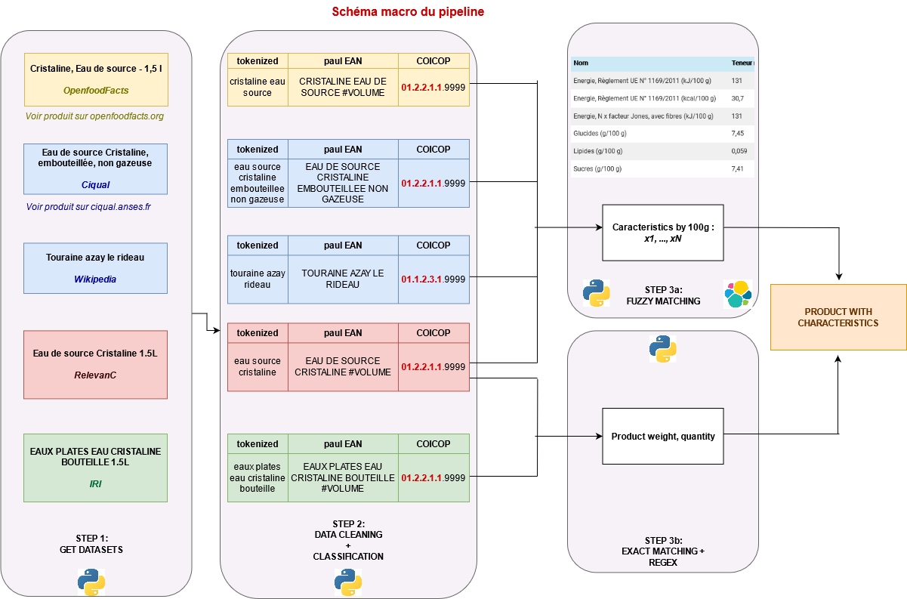
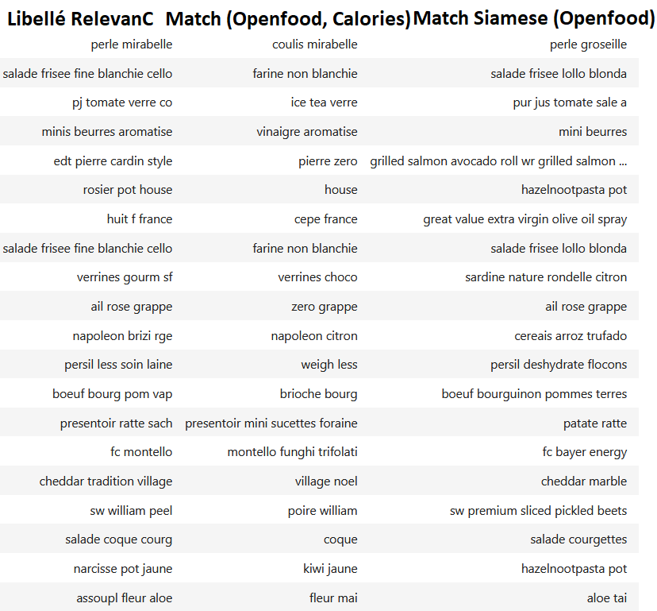
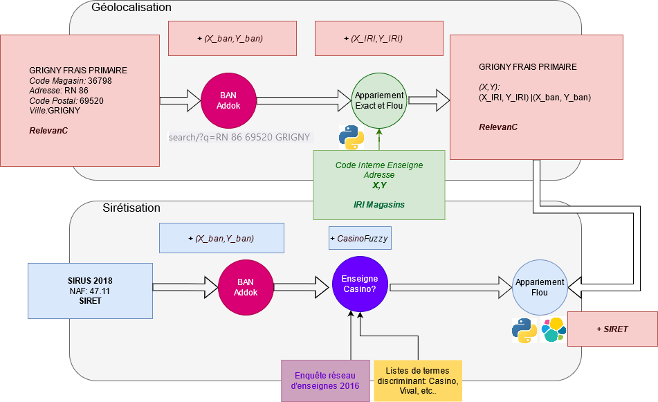

```{r setup, include=FALSE}
options(htmltools.dir.version = FALSE)
knitr::opts_chunk$set(echo = FALSE)
```


# Introduction

## Problématique (1/2)

* Alimentation affecte variables de **santé publique** ayant un effet de premier ordre sur bien-être :
    + obésité
    + mortalité différentielle

--
* **Facteurs sociaux** et **territoriaux** interagissent
    + Interaction avec les inégalités socioéconomiques: Caillavet et al. (2020)
    + Malgré réglementations (ex: nutriscore), beaucoup d'asymétries d'information

--
* Alcott et al. (2019) proposent une décomposition entre effets:
    + d'offre (déserts alimentaires)
    + de demande (préférences pour la _junk food_)
* Commencer par documenter les inégalités de *"qualité"* de consommation
    + Avant d'essayer de distinguer effets offre et demande


---
# Introduction

## Problématique (2/2)

<br><br>

* Au sein d'une classe de produit (ex: lasagnes), énormément d'**hétérogénéité** de *"qualité"*
    + Low-cost vs autres produits
    + Bio vs agriculture traditionnelle

--
* Besoin de **données très fines** pour distinguer les qualités nutritionnelles (Caillavet et al. 2020)


--
* D'où l'utilisation de **sources de collectes automatisées**:
    + Données d'enquête (notamment Budget des Familles) serviront à vérifier la cohérence voire caler
    + Autres sources administratives pour contrôler la qualité des données

---
# Introduction

## Enjeux

* Besoin d'**enrichissements multiples**:
    + Sur la dimension `géographique` ;
    + Sur la dimension `produit`

--
* Méthode des **appariements flous**: 
    + Compenser absence d'identifiants pour appariements exacts
    + Noms produits
    + Adresse magasins

--
* **Catégorisation** pour réduire le nombre de paires
    + COICOP
    + Département

<br><br>
**Approche généralisable à de nombreux problèmes de la statistique publique**


---
#  Données

## `RelevanC`

* Données de caisses du groupe Casino
    + Casino, Monoprix, Franprix au *niveau magasin* et *cartes fidélité*
    + Leader Price et des petites chaînes (stations services, Sherpa...) au *niveau magasin* exclusivement
* $\approx$ 11 000 magasins
* $\approx$ 250 000 produits


---
#  Données

## `RelevanC`

```{r}
knitr::include_graphics("images/schema-structure.drawio.png")
```


---
#  Données
## Référentiels `IRI`

* Référentiel de __produits__ et de __magasins__ achetés par l'Insee
    + Mis à jour toutes les semaines

--
* Une base intéressante pour les **appariements exacts** :
    + Bon taux d'appariement EAN
    + Informations utiles: bio, poids du produit...

--
* Libellés propres:
    + $\neq$ données de caisses collectées automatiquement

--
* Exploite pour la **dimension poids**:
    + Nécessaire de creuser pour d'autres utilisations...
    + ... appariements flous notamment 
--
* Référentiel des points de ventes IRI :
    + Enseignes 
    + Coordonnées géographiques

---
#  Données

## `OpenFoodFacts` ()

* Base de données contributive et open-source (alternative à `Yuka`)
    + Actualisée en continu ;
    +  Mise à disposition de csv de manière quotidienne ;
    +  Plusieurs API
* $\approx$ **2 millions de produits**

--
* Beaucoup d'infos disponibles
    + _Scores de qualité agrégés_ : nutriscore, score NOVA, écoscore
    + _Infos nutritionnelles_: calories, glucides, lipides, etc.
    + _Infos sur produit_: packaging, etc.

--
* _Challenge_:  qualité et taux de complétude variable
    + Valeurs manquantes
    + Erreurs de remplissage et fautes d'ortographe


---
#  Données

## `CIQUAL` ()

* Base de données élaborée par l'`Anses`
    + **Produits standardisées**
    + Beaucoup d'infos disponibles
    + _Challenge_:  meilleure qualité mais produits standardisés

--
* Globalement même information qu'`OpenFoodFacts`:
    + Mais, perte d'une dimension dans l'hétérogénéité produit

--
* Besoin d'enrichir certaines classes de produits:
    + Faible variabilité nutritionnelle
    + Forte hétérogénéité des labels des sous-classes: marques, domaines, goûts...

---
#  Données
## Dictionnaires de produits via Wikipédia

```{r}

```


---
# Modèle `fasttext` COICOP

<br><br>
* Réutilisation d'un output du projet `PAul-EAN`:
    + modèle de prédiction de la classe COICOP
    + entrainé sur _l'ensemble_ des données de caisse 
<br><br>

--
Pour deux usages :

* COICOP prédite servira de variable de blocage
* Création d'une _distance_ ad-hoc entre libellés:
    + via un plongement de mots (`word embedding`)
    + initialisé sur le plongement de mots issu de ce modèle 


---
# Appariement produits: vue globale

```{r}

```


---
# Data cleaning et catégorisation

```{r}
knitr::include_graphics('images/macro-ombre2.png')
```

---
# Enjeu du data cleaning

* Réduire le bruit dans les données ;
* Harmoniser les jeux de données ;
* Détecter des produits non alimentaires malgré filtre rayons.

<br><br>
```{r, fig.show="hold", out.width="48%", fig.cap="Nuage de mot: OpenFood (gauche) et RelevanC (droite)"}


```

---
# Pipeline de data-cleaning


```{r}
knitr::include_graphics("images/step2-cleaning-categorisation.drawio.png")
```

---
# Pipeline de data-cleaning
## Premières étapes: définir le champ le plus précis et cohérent possible

1. Consolidation des bases des différentes chaînes
2. Elimine des produits non alimentaires (`RelevanC` et `OpenFood`)
3. Retire des abbréviations qui apportent du bruit

```{r}

```

---
# Pipeline de data-cleaning
## Premières étapes: définir le champ le plus précis et cohérent possible

3. Identification par expression régulière d'infos sur le produit
    + Remplacement par des mots-clés (`#VOLUME`, `#POIDS`, `#UNITE`, `#LOT`...) pour la classification
    + Suppression de ces infos pour le libellé d'appariement flou

```{python, eval = FALSE, echo = TRUE}
r'\d+\.?\d*\s?(K?G(R|E)?(X\d+)?)\b': '{}'.format(weigt_exp),
r'\d+\.?\d*\s?([CM]?L)\b': '{}'.format(vol_exp),
r'\d+\s?(X|\*)\s?\d*\b': '{}'.format(lot_exp),
```

```{r}

```

---
# Pipeline de data-cleaning
## Deuxième étape: normalisation des noms de produits

4. Transformation en suite d'unités signifiantes (`token`)
    + Retrait des _stopwords_ qui n'apportent pas d'info sur le produit 
    + Mots comme _token_
    + `nltk` plutôt que `spaCy`
    + Pas de `stemming` (défini au niveau de la requête `Elastic`)
    + Les *n-grams* sont définis au niveau de la requête `Elastic`

```{r}

```


---
# Pipeline de data-cleaning
## Deuxième étape: normalisation des noms de produits

<input type="checkbox" checked> Réduire le bruit dans les données ; </input>
<input type="checkbox" checked> Harmoniser les jeux de données ; </input>
<input type="checkbox" checked> Détecter des produits non alimentaires malgré filtre rayons. </input>


<br><br>
```{r, fig.show="hold", out.width="48%", fig.cap="Nuage de mot: OpenFood (gauche) et RelevanC (droite)"}
knitr::include_graphics('images/openfood_tokenized.png')

``` 

---
# Pipeline de data-cleaning
## Deuxième étape: normalisation des noms de produits

|                 Libellé d'origine |          Libellé tokenisé |             Libellé classification  |
|-----------------------------------|---------------------------|-------------------------------------|
|                  NUTELLA POT 225G |               nutella pot |                 NUTELLA POT #POIDS  |
|          PULCO DELICE AGRUME 70CL |       pulco delice agrume |        PULCO DELICE AGRUME #VOLUME  |
|Cristaline Eau de source - 1,5 l & |   cristaline eau source & | CRISTALINE EAU DE SOURCE #VOLUME    |
|             COCA COLA CANETTE 1KG |         coca cola canette |           COCA COLA CANETTE #POIDS  |
|           Brioche tranchée nature |   brioche tranchee nature |             BRIOCHE TRANCHEE NATURE |
|               °RELIGIEUSE CAFE X2 |        degreligieuse cafe |            DEGRELIGIEUSE CAFE #LOT  |
|1/2 CHEVREAU S/TET S/ABA 2,5KG ENV |      chevreau tet aba env |    12 CHEVREAU STET SABA #POIDS ENV |
|   SAINT EMILION PUY RAZAC RG 75CL | saint emilion puy razac   | SAINT EMILION PUY RAZAC RG #VOLUME  |

---
# Classification
## Classement dans la COICOP

* Chercher un nom de produit proche dans $\approx$ 2 millions est une tâche excessivement complexe...
    + ... surtout quand on doit le faire 250 000 fois
    + Equivalent à un produit cartésien de $10^{13}$ opérations (nombre de cellules dans le corps humain)

--
* Trouver une __variable de blocage__ pour n'associer qu'une partie des paires entre-elles:
    + Améliore la pertinence de la recherche
    + Réduit drastiquement la complexité du problème

--
* Pas de variable commune dans nos différentes sources:
    + Rayon: faible qualité, pas correspondance entre sources
* Utilisation `COICOP`

---
# Classification
## Classement dans la COICOP

* __Réseau neurone entraîné sur données de caisses__
    + Jamais accès aux données d'entraînement !

--
* Utilisation des poids estimés grâce au binaire `fasttext`

--
* Classement à un niveau très fin (plus fin que niveau poste)
    + `01.2.2.1.1`: _Eaux minérales et de source_

```{r}
knitr::include_graphics("images/step2-cleaning-categorisation-part3.png")
```

---
# Classification
## Exemples

|                  Libellé d'origine |    Libellé tokenisé |             Libellé classification  |
|------------------------------------|---------------------|-------------------------------------|
|                  NUTELLA POT 225G  |     01.1.8.3.2.0001 |               Confiseries à base de chocolat |
|          PULCO DELICE AGRUME 70CL  |     01.2.2.2.1.9999 |                    Boissons rafraîchissantes |
|             COCA COLA CANETTE 1KG  |     01.2.2.2.1.0005 |                    Boissons rafraîchissantes |
|  Cristaline Eau de source - 1,5 l  |     01.2.2.1.1.9999 |                  Eaux minérales ou de source |
|              CITRONS VERTS FILETS  |     01.1.9.4.1.0006 |                        Plats cuisinés n.c.a. |
|           Brioche tranchée nature  |     01.1.1.3.1.0001 |                                         Pain |
|               °RELIGIEUSE CAFE X2  |     05.6.1.2.1.9999 | Petits articles pour l'entretien du logement |
|1/2 CHEVREAU S/TET S/ABA 2,5KG ENV  |     01.1.2.3.1.9999 |                     Mouton, agneau et chèvre |
|   SAINT EMILION PUY RAZAC RG 75CL  |     02.1.2.1.2.0005 |                              Vins supérieurs |


---
# Appariement
## Pipeline général

* On recherche dans `OpenFood`/`CIQUAL` un produit des données de caisses
* Une procédure pour aller de l'appariement le plus certain
au plus incertain:
    1. __Appariement EAN__ si disponible dans `OpenFood`
    1. __Appariement flou__ dans les produits `OpenFood` ayant le même code `COICOP`
    1. __Appariement flou__ dans tous les produits `OpenFood`
    1. __Appariement flou__ dans tous les produits `CIQUAL` (enrichie avec le dico `Wikipedia`)
* **Critères de validation** conservateurs pour exclure faux positifs

---
# Appariement
## Pipeline général

* Code `Python` `r fontawesome::fa("python")` pour gérer ce _pipeline_ <br><br>
* Package `foodbowl` `r emo::ji('ramen')`
    + Gère la connexion à `S3` et `Elastic`
    + Mise en forme des requêtes, récupération des échos...
    + Validation des *outputs* (distance textuelle et potentiellement réseau de neurone `PyTorch`)
    + Déploiement sous forme d'API grâce à `fastAPI` (à venir)

---
# Etape 1: appariement EAN

*  **EAN** est un identifiant produit unique: appariement exact entre `RelevanC` et `OpenFood`
* Pour la calorie: permet d'enrichir **46% des données** `RelevanC`
* Appariement servira de **base d'entraînement** pour le réseau siamois

```{r}

```


---
# Etape 2
## Objectif du fuzzy matching

```{r}

```


---
# Etape 2: appariement flou
## Pourquoi `ElasticSearch` ?

* __Liberté__ dans la recherche:
    + Mélange critères distances textuelle pure (type Levensthein)...
    + ... avec d'autres critères (ngrams...)
--

* Extrêmement __performant__:
    + Parallélisation des recherches
    + Recherches optimisées
    + Recherches multiples, asynchrones, etc. 
    
* _Exemple_: Performance pour apparier et valider 100 produits `RelevanC` : 

| Approche | Temps de calcul (en secondes) |
|----------|-----------------|
|`ElasticSearch`    |            0.92 |
|`rapidfuzz`  |           97.20 |
|`fuzzywuzzy` |           99.90 |

---
# Etape 2: appariement flou
## `ElasticSearch` comment ?

* *Open-source*, possibilité d'avoir des instances internes
    + SSP-Cloud
    + Instance Kube interne
* Livré avec interface graphique `Kibana`:
    + Pratique pour *monitoring*
    + Mieux vaut passer par `Python` pour **indexation** & **requêtage**
* Package officiel `elasticsearch` pour intégration à `Python`
    + Repose sur le format JSON (pratique en `Python` !)

---
# Etape 2: appariement flou
## `ElasticSearch` dans notre *pipeline*

```{r}

```

---
# Etape 2: appariement flou
## `ElasticSearch` avec `r fontawesome::fa("python")`

* Connexion simple:

```{python, eval = FALSE, echo = TRUE}
from elasticsearch import Elasticsearch
es = Elasticsearch([{'host': HOST, 'port': 9200}], http_compress=True, timeout=200)
```

--
* Création d'un *index* à partir d'un `DataFrame` :

```{python, eval = FALSE, echo = TRUE}
from elasticsearch.helpers import parallel_bulk
es.indices.create(index=index_name, body=mapping)
deque(parallel_bulk(client=es, actions=gen_dict_from_pandas(index_name, df), chunk_size=2000, thread_count=4))
```

--
* Envoi et récupération de plusieurs requêtes :

```{python, eval = FALSE, echo = TRUE}
es.msearch(body=req, max_concurrent_searches=1000)
```

---
# Etape 2: appariement flou
## `ElasticSearch` avec `r fontawesome::fa("python")`

Exemple de requête

```{python, eval = FALSE, echo = TRUE}
{
  "query": {
    "bool": {
      "should": [
        { "match": { "libel_clean_OFF":  { "query":  "pulco delice agrume" , "boost" : 10}}},
        { "match": { "libel_clean_OFF.ngr":   "pulco delice agrume" }},
        { "match": { "libel_clean_OFF.stem":   "pulco delice agrume" }},
        { "match":  { "prediction.9car": "01.2.2.2.1.9999" }}],
      "minimum_should_match": 3,
      "filter": [
        { "match":  { "prediction.7car": "01.2.2.2.1.9999" }},
        {"exists" : {
               "field" : "energy_100g"
        }}
      ]
    }
  }
}
```

---
# Etape 2: appariement flou
## `ElasticSearch` avec `r fontawesome::fa("python")`: retour d'expérience

* Pas besoin d'avoir la certification [*Elastic Engineer*](https://www.elastic.co/fr/training/elasticsearch-engineer)
pour gagner à l'utiliser
<br>

--
* Gains de performance importants, même avec une requête sous-optimale
    + Requêtes asynchrones à creuser
<br>

--
* Gain en flexibilité à creuser
    + Exemple: étape de validation par distance Levensthein avant le renvoi d'écho
    serait plus performant
<br>


---
# Etape 2: critère de validation

* `rapidfuzz.fuzz.partial_ratio(s1, s2)`: meilleure similarité entre
    + la chaîne de caractère la plus courte `s1`, de longueur `n`
    + les `n`-grammes de  `s2` `r emo::ji("exploding_head")`
* Similarité : distance de Levenshtein (y compris transposition) normalisée par la longueur `n`
*  Critère conservateur: valide paire si `partial_ratio(s1, s2) > 0.65`

```{r}
knitr::include_graphics("images/partial_ratio.png")
```

---
# Une distance adaptée à notre problème?

La proximité de caractère (**proximité syntaxique**) n'implique pas nécessairement une
**proximité sémantique**.
<br><br>

| Libellé d'origine | Libellé du match |
| --- | --- | 
| oe poulet blanc fermier | poulet blanc fermier |
| tarte chevre epinar co 	| epinar |
|  lapin or sous alu 	| oeufs sous alu |
<br><br>

--
* Test d'un plongement de mots (`word embedding`):
    + associer à un libellé un vecteur dans $\mathbb{R}^N$
    + dont la position dans cette espace reflèterait un concept de produit
* En déduire une distance non exclusivement basée sur la chaîne de charactère

---
# Réseaux siamois 
## Principe

```{r}

```

---
# Réseaux siamois 

```{r}
knitr::include_graphics("images/siamese.png")
```

---
# Qu'est-ce que ça donne? (1/2)

Un appariement fondé sur la proximité entre représentation vectorielle des libellés?

```{r}

```


* Performant sur les libellés qui se ressemblent (même mot = même plongement)
* Des concepts appris, mais sur des produits de grande consommation, pour lesquels on a en général des échos 
* Qualité des matchs $\approx$ Pipeline Elastic,
    + mais coûteux à intégrer à la pipeline avec d'autres critères (e.g. glucides non manquantes) de façon aussi flexible que ce que permet Elastic
    + parfois difficile d'expliquer la proximité entre libellés qui a été apprise
  
---
# Qu'est-ce que ça donne? (2/2)
  
* Finalement, **utilisation en complément** pour **repérer les faux positifs** de la Pipeline Elastic
* ajuster la pipeline en fonction des erreurs repérées

```{r, fig.cap = 'Les désaccords au sens de la distance siamoise entre le match Pipeline Elastic et le match Siamois repère les cas problématiques.', fig.topcaption=TRUE}

```

---
# Bilan de l'appariement produit
## Taux d'appariements globaux

* Le matching `OpenFood` avec Elastic permet d'enrichir $\approx$ 40% de nos produits
    + Le matching `CIQUAL` permet ensuite de rattraper $\approx$ 5% de nos produits
* Calories: 98% des produits enrichis (part supérieure en CA)

|   Etape            |   Nombre produits |     Proportion |   Part cumulée |
|-------------------:|---------:|----------:|-----------:|
|                  1 |   117 889 | 46.5%  |   46.5% |
|                  2 |   110 590 | 43.6%  |   90.1% |
|                  3 |    13 732 | 5.5%  |   95.6% |
|                  4 |     6924 | 2.7%  |   98.3% |
|                  Pas imputés |     4167 | 1.7% |   100%        |


```{r}

```

---
# Bilan de l'appariement produit
## Taux d'appariements globaux

* Marche aussi bien pour des caractéristiques autres que la calorie

```{r}

```

---
# Bilan de l'appariement produit
## Exemples aléatoires

|        | LIBELLE                             | libel_clean_relevanc       | energy_100g_libel_clean_OFF                                                                     |   energy_100g |
|-------:|:------------------------------------|:---------------------------|:------------------------------------------------------------------------------------------------|--------------:|
| 164915 | NECTARINE BLANCHE BABY              | nectarine blanche baby     | branche blanche                                                                                 |          2389 |
| 152224 | MELON CJ 1150/1350GR                | melon cj                   | melon                                                                                           |           169 |
|  30079 | BETTERAVE FRAICHE 375GR             | betterave fraiche          | betterave                                                                                       |           209 |
| 120809 | IGP OC CINSAULT J.ALIBERT RS 6X75CL | igp oc cinsault alibert rs | rs                                                                                              |          1540 |
|  65589 | CIBOULETTE SPIGOL BM 12G            | ciboulette spigol bm       | ciboulette                                                                                      |          1163 |
| 219095 | SCISSE MORTEAU CUITE IGP 140G       | scisse morteau cuite igp   | saucisse morteau igp cuite                                                                      |          1393 |
| 168619 | OIGNON JAUNE 1KG C1 FR              | oignon jaune fr            | oignon oignon jaune                                                                             |           130 |
|  91746 | ECHALOTTE BOTTE J+2                 | echalotte botte            | echalotte                                                                                       |           427 |
|  57184 | CDP LA CLAPIERE CRU CLAS RS 75CL    | cdp clapiere cru clas rs   | rs                                                                                              |          1540 |
|  70613 | COFFRET ORFEVRE 37,5CL              | coffret orfevre            | coffret cadeau ninkasi classique ninkasi blonde ninkasi ambree ninkasi french ipa ninkasi noire |           181 |

---
# Appariement magasin

```{r}

```

---
# Appariement magasin: Géolocalisation

```{r}
knitr::include_graphics("images/macro_geoloc.png")
```

---
# Géolocalisation à partir de la BAN

```{r}

```


---
# Géolocalisation
## Rapprochement au référentiel `IRI`

* __Appariement Exact__: à partir d'un code interne magasin (par enseigne) disponible dans le répertoire IRI
* __Appariement Flou__: à l'aide de la librarie python `recordLinkages`
<br><br>

* Recherche d'un match à partir de 
    + _Blocage:_ Code Postal; _Champ comparé et noté:_ Nom du magasin, Libellé d'enseigne, Adresse `string` et X,Y `PointGeo`. 
    $$m_1 > 3 $$ 
    + _Blocage:_ Département; _Champ comparé et noté:_ Nom du magasin, Libellé d'enseigne, Adresse, Ville `string` et X,Y `PointGeo`
    $$m_2 > 5 $$ 
  

  $$m_1 = 3 \times SimLev(Adresse,0.6) + 2  \times SimLev(Enseigne,0.9) + 1.5  \times SimGeo(X,Y) $$ 
  $$+ 0.5  \times SimLev(Denom,0.2)$$
    

  $$m_2 = 3 \times SimLev(Ville,0.8) + 2 \times SimLev(Adresse,0.6) +1  \times SimLev(Enseigne,0.9) +$$
    $$1  \times SimGeo(X,Y) + 1  \times SimLev(Denom,0.2) $$

---
# Geolocalisation: Bilan

| Origine des $(x,y)$ | Magasins | Autre $(x,y)$ | Au moins 1 désaccord (>1km) |
|---------------------|----------|---------------|-----------------------------|
|           Relevanc  | 470      |    464        |  31                         |
|         IRI: exact  | 3516      |    3465        |  412                         |
|         IRI: flou  | 3428      |    3419        |  329                         |
|         Addok-BAN  | 4089      |    0        |  0                         |
|         NA  | 113      |    0        |  0                         |


---
# Geolocalisation
## Bilan (2/2)

                 
* Parmi les magasins géolocalisé en *"IRI exact"* et en *"Addok-Ban"*, distance entre les deux options (en mètres):

| 10% | 50% | 80% | 90% |
|-----|-----|-----|-----|
|10 |  130 |  460 | 1150 |

---
# Appariement Magasin: Siretisation

```{r}

```

---
# Appariement Magasin
## Siretisation

1. __Appariement Flou__: à l'aide de la librarie python `recordLinkages` ( $\approx$ IRI )
2. Complétée, pour les magasins au plus gros CA (e.g. Géant Casino) :
    + recherches ad-hoc via Elastic via critères additionels...
    + ... comme l'utilisation du SIREN de l'U.L. *"Casino Distribution France"*

* Recherche d'un match dans:
  1. `SIRUS` 47.11, suceptible d'appartenir à l'enseigne Casino dans le même code postal
  2. `SIRUS` 47.11, dans le même code postal
  3. `SIRUS` 47.11, dans le même département

---
# Siretisation
## Exemples aléatoires

En blanc la requête, en gris l'écho

| Nom magasin          | Adresse            | Ville           |
|----------------------|--------------------|------------------|
| PS ALLIGNY COSNE VIVAL | 18 ROUTE DE BOUHY | ALLIGNY COSNE  | 
| VIVAL AUX GOURMETS | 18 ROUTE DE BOUHY | 58200 ALLIGNY-COSNE  | 
| NICE RAOUL BOSIO SPAR | 2 BIS RUE RAOUL BOSIO | NICE  | 
| SPAR NISACOL | 2 BIS RUE RAOUL BOSIO | 06300 NICE  | 
| LP BASSENS LEADER PRICE | 23 AV DE LA SOMME | BASSENS  | 
| LEADER PRICE BASSENS | AVENUE DE LA SOMME | 33530 BASSENS  | 
| PS DOMENE LE PETIT CASINO | PLACE DE STALINGRAD | DOMENE  | 
| DISTRIBUTION CASINO FRANCE LE PETIT DE DOMENE | PLACE STALINGRAD | 38420 DOMENE  | 

---
# Siretisation
## Exemples aléatoires

En blanc la requête, en gris l'écho

| Nom magasin          | Adresse            | Ville           |
|----------------------|--------------------|------------------|
| SEBASTOPOL FRANPRIX | 12-14 RUE SANTEUIL | PARIS  | 
| SEBASTOPOL DISTRIBUTION | 14 RUE SANTEUIL | 75005 PARIS  | 
| SM CASINO ST PIERRE SUR DIVES SUPERMARCHE HYPER | ROUTE DE LISIEUX | ST PIERRE SUR DIVES  | 
| DISTRIBUTION CASINO FRANCE | RUE DE LISIEUX | 14170 SAINT-PIERRE-EN-AUGE  | 
| POINT RETRAIT SM HARDRICOURT | 60 RUE DU VEXIN | HARDRICOURT  | 
| DISTRIBUTION CASINO FRANCE | 60 RUE DU VEXIN | 78250 HARDRICOURT  | 
| ALYE FRANPRIX | RUE HENRI SPAAK | VERNOUILLET  | 
| NEWDNERA FRANPRIX | RUE PAUL HENRI SPAACK | 28500 VERNOUILLET  | 
| NEWFPMAG MONTROUGE FRANPRIX | 37 RUE BARBES | MONTROUGE  | 
| FRANPRIX MONTROUGE MARKET | 37 RUE BARBES | 92120 MONTROUGE  | 


---
# Conclusion
## Appariements

* Appariements flous multiples:
    + 98% des magasins géolocalisés, XX% des produits enrichis grâce à l'`OpenFood` ou `CIQUAL`
    + Marges d'amélioration sur la validation *ex-post* des échos

* Gains énormes à utiliser la technologie `ElasticSearch` en l'absence
d'identifiants exacts:
    + Recoder appariements flous en `r fontawesome::fa("python")` ou `r fontawesome::fa("r-project")` purs serait une mauvaise idée
    + Prise en main minimale très rapide de l'outil (merci à ceux qui nous ont aidés ! `r emo::ji("thumbs_up")`)
    + Encore des gains possibles
    
---
# Conclusion
## Perspectives

* _Pipeline_ asynchrone du fait des données présentes dans des environnements différents

* Enjeu de la temporalité des données
    + `IRI`, `OpenFood` et les données de caisses sont des données qui évoluent
    +  Privilégier l'API d'`OpenFood` pour la mise à jour ?
    + `ElasticSearch` permet de tenir compte de critères de temporalité dans les requêtes et l'indexation

* Outils existent pour améliorer l'entraînement des modèles et le déploiement de ceux-ci pour une mise à disposition:
    + *Un exemple*: `MLFlow` sur `SSP-cloud`

    